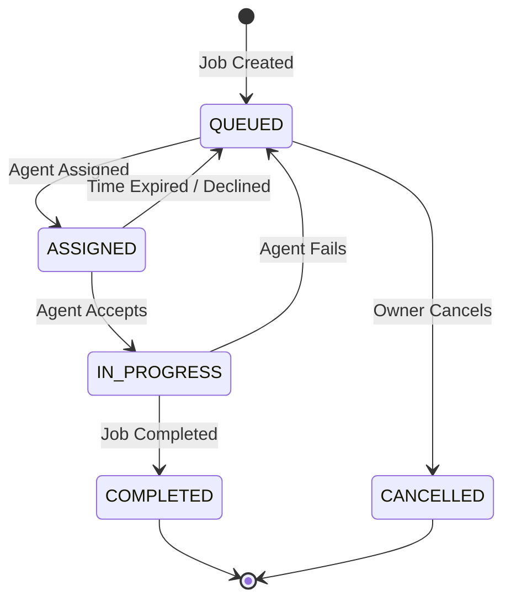

# Queue System Documentation

## Overview

The Agent Queue System implements a sophisticated First-Come-First-Served (FCFS) queue with time-slot management, automatic rotation, and performance-based optimization for property marking jobs.

## Table of Contents

- [Core Concepts](#core-concepts)
- [Queue Architecture](#queue-architecture)
- [Queue Workflow](#queue-workflow)
- [Time Slot Management](#time-slot-management)
- [Assignment Algorithm](#assignment-algorithm)
- [Performance Tracking](#performance-tracking)
- [Notification System](#notification-system)
- [Edge Cases & Handling](#edge-cases--handling)
- [API Reference](#api-reference)

## Core Concepts

### 1. First-Come-First-Served (FCFS)

Agents are assigned jobs in the exact order they join the queue. This ensures fairness and prevents gaming the system.

```
Queue: [Agent A, Agent B, Agent C] → Job → Agent A gets it first
```

### 2. Time Slots

Each agent receives a **3-hour time window** to complete their assigned job:
- Timer starts when job is assigned
- Agent must accept and complete within 3 hours
- Auto-rotation to next agent if expired

### 3. Geographic Proximity

Only agents within reasonable distance are notified:
- Default radius: 10-20 km
- Configurable per job urgency
- Prevents unnecessary notifications

### 4. Automatic Rotation

When time expires or agent declines:
- Job automatically moves to next agent in queue
- Original agent's reliability score may be affected
- Seamless transition without property owner intervention

### 5. Queue Position Tracking

Real-time position updates for agents:
- Current position in queue
- Estimated wait time
- Jobs ahead in queue
- Probability of assignment

## Queue Architecture

### Data Structures

#### 1. Redis Queue (Primary)

```typescript
// Queue key pattern
marking_queue:{jobId} → [agentId1, agentId2, agentId3, ...]

// Position tracking
agent_position:{agentId}:{jobId} → position_number

// Time slot tracking
timeslot:{jobId}:{agentId} → {
  startTime: timestamp,
  expiryTime: timestamp,
  status: 'active' | 'expired' | 'completed'
}
```

#### 2. PostgreSQL (Persistent)

```sql
-- PropertyMarkingJob table stores queue state
queuePosition: INT
status: QUEUED | ASSIGNED | IN_PROGRESS | COMPLETED | CANCELLED | EXPIRED
assignedAgentId: STRING
timeSlotExpiry: TIMESTAMP
```

### Queue States



## Queue Workflow

### Complete Flow Diagram

```
┌─────────────────────────────────────────────────────────────┐
│ 1. JOB CREATION                                              │
│    Property Owner creates marking job                        │
│    ├─ Payment: ₦20,000                                      │
│    ├─ Max completion time: 3 days                           │
│    └─ Status: QUEUED                                        │
└─────────────────────────────────────────────────────────────┘
                          ↓
┌─────────────────────────────────────────────────────────────┐
│ 2. AGENT NOTIFICATION                                        │
│    System broadcasts to nearby agents                        │
│    ├─ Proximity filter: 10-20 km radius                    │
│    ├─ Notification channels: Email, SMS, Push              │
│    └─ Job details: Location, fee, urgency                  │
└─────────────────────────────────────────────────────────────┘
                          ↓
┌─────────────────────────────────────────────────────────────┐
│ 3. QUEUE JOINING                                             │
│    Agents join the queue (FCFS)                             │
│    ├─ Agent A joins → Position 1                           │
│    ├─ Agent B joins → Position 2                           │
│    ├─ Agent C joins → Position 3                           │
│    └─ Queue limit: 50 agents max                           │
└─────────────────────────────────────────────────────────────┘
                          ↓
┌─────────────────────────────────────────────────────────────┐
│ 4. ASSIGNMENT                                                │
│    First agent (Position 1) gets assigned                   │
│    ├─ Status: QUEUED → ASSIGNED                            │
│    ├─ 3-hour timer starts                                   │
│    ├─ Notification sent to Agent A                         │
│    └─ Other agents remain in queue                         │
└─────────────────────────────────────────────────────────────┘
                          ↓
┌─────────────────────────────────────────────────────────────┐
│ 5. AGENT ACCEPTANCE                                          │
│    Agent A accepts the job                                   │
│    ├─ Status: ASSIGNED → IN_PROGRESS                       │
│    ├─ Partial payment: ₦1,000 released to agent            │
│    ├─ Contact details shared with agent                    │
│    └─ Property access info provided                        │
└─────────────────────────────────────────────────────────────┘
                          ↓
┌─────────────────────────────────────────────────────────────┐
│ 6a. SUCCESSFUL COMPLETION                                    │
│    Agent marks property successfully                         │
│    ├─ Upload boundary photos                                │
│    ├─ Submit completion report                             │
│    ├─ Owner verification (2-3 days)                        │
│    └─ Full payment: ₦5,000 released                        │
└─────────────────────────────────────────────────────────────┘
                          OR
┌─────────────────────────────────────────────────────────────┐
│ 6b. TIME EXPIRATION / FAILURE                                │
│    3-hour time slot expires or agent fails                   │
│    ├─ Status: ASSIGNED → QUEUED                            │
│    ├─ Job reassigned to Agent B (Position 2)               │
│    ├─ Agent A's reliability score decreases                │
│    └─ Process repeats from step 4                          │
└─────────────────────────────────────────────────────────────┘
```

### Detailed Step-by-Step Process

#### Step 1: Job Creation

```typescript
// Property owner creates job
POST /api/marking-jobs
{
  propertyId: "prop_123",
  contactPersonName: "John Doe",
  contactPersonPhone: "+234...",
  preferredTime: "2024-01-15T10:00:00Z",
  urgencyLevel: "NORMAL"
}

// System response
{
  id: "job_456",
  status: "QUEUED",
  queuePosition: null, // No agents yet
  markingFee: 20000,
  maxCompletionTime: "2024-01-18T10:00:00Z" // 3 days
}
```

#### Step 2: Agent Notification

```typescript
// System broadcasts to nearby agents
notificationService.broadcastToNearbyAgents({
  jobId: "job_456",
  location: { lat: 6.5244, lng: 3.3792 },
  radius: 10, // km
  channels: ['email', 'sms', 'push']
});

// Notification content
{
  title: "New Property Marking Job Available",
  message: "A property marking job in Ikeja is available. Fee: ₦5,000",
  data: {
    jobId: "job_456",
    location: "Ikeja, Lagos",
    distance: "5.2 km away",
    fee: 5000,
    estimatedTime: "1-2 hours"
  }
}
```

#### Step 3: Queue Joining

```typescript
// Agent A joins queue
POST /api/queue/join
{
  jobId: "job_456",
  agentId: "agent_001"
}

// Response
{
  queuePosition: 1,
  estimatedWaitTime: "0 minutes", // First in queue
  jobsAhead: 0
}

// Agent B joins queue
POST /api/queue/join
{
  jobId: "job_456",
  agentId: "agent_002"
}

// Response
{
  queuePosition: 2,
  estimatedWaitTime: "3-6 hours",
  jobsAhead: 1
}
```

#### Step 4: Assignment

```typescript
// System assigns to first agent
assignmentService.assignToNextAgent("job_456");

// Updates
{
  jobStatus: "ASSIGNED",
  assignedAgentId: "agent_001",
  timeSlotExpiry: "2024-01-15T13:00:00Z", // 3 hours from now
  notificationSent: true
}

// Agent notification
{
  title: "Job Assigned to You!",
  message: "You have 3 hours to accept and complete the marking job",
  action: "View Job Details"
}
```

#### Step 5: Acceptance

```typescript
// Agent accepts job
POST /api/assignments/accept
{
  jobId: "job_456",
  agentId: "agent_001"
}

// Payment processing
{
  partialPayment: 1000, // ₦1,000
  remainingPayment: 4000,
  releaseCondition: "OWNER_VERIFICATION"
}

// Status update
{
  jobStatus: "IN_PROGRESS",
  acceptedAt: "2024-01-15T10:30:00Z",
  agentContactShared: true
}
```

#### Step 6a: Successful Completion

```typescript
// Agent completes job
POST /api/assignments/complete
{
  jobId: "job_456",
  agentId: "agent_001",
  completionImages: ["url1", "url2", "url3"],
  boundaryData: {...},
  completionNotes: "Property successfully marked"
}

// Owner verification period starts
{
  status: "AWAITING_VERIFICATION",
  verificationDeadline: "2024-01-18T10:30:00Z", // 3 days
  notificationSentToOwner: true
}

// Owner verifies within deadline
POST /api/marking-jobs/job_456/verify
{
  approved: true,
  feedback: "Excellent work!"
}

// Final payment release
{
  remainingPayment: 4000,
  releasedAt: "2024-01-16T09:00:00Z",
  agentReliabilityScoreUpdated: true, // +0.2
  jobStatus: "COMPLETED"
}
```

#### Step 6b: Time Expiration / Failure

```typescript
// 3-hour timer expires
// Automatic system action
{
  event: "TIME_SLOT_EXPIRED",
  jobId: "job_456",
  previousAgent: "agent_001",
  action: "REASSIGN_TO_NEXT"
}

// Job reassignment
{
  jobStatus: "QUEUED", // Temporarily back to queued
  assignedAgentId: "agent_002", // Next in queue
  newTimeSlotExpiry: "2024-01-15T16:00:00Z",
  queuePosition: 1 // Agent B is now first
}

// Agent A penalty
{
  reliabilityScoreChange: -0.1,
  newReliabilityScore: 3.9,
  reason: "TIME_SLOT_EXPIRED"
}
```

## Time Slot Management

### Time Slot Configuration

```typescript
interface TimeSlotConfig {
  duration: number; // 3 hours (in milliseconds)
  gracePeriod: number; // 15 minutes buffer
  maxExtensions: number; // 0 (no extensions allowed)
  autoRotateOnExpiry: boolean; // true
}
```

### Time Slot States

| State | Description | Duration |
|-------|-------------|----------|
| **PENDING** | Job in queue, no time slot assigned | Unlimited |
| **ACTIVE** | Agent assigned, timer running | 3 hours |
| **GRACE_PERIOD** | Extra time before auto-rotation | 15 minutes |
| **EXPIRED** | Time slot ended, reassignment triggered | N/A |
| **COMPLETED** | Job finished within time slot | Variable |

### Timer Implementation

```typescript
class TimeSlotService {
  // Start time slot when job assigned
  async startTimeSlot(jobId: string, agentId: string): Promise<void> {
    const expiryTime = Date.now() + (3 * 60 * 60 * 1000); // 3 hours
    
    await redis.setex(
      `timeslot:${jobId}:${agentId}`,
      3 * 60 * 60, // 3 hours in seconds
      JSON.stringify({
        startTime: Date.now(),
        expiryTime,
        status: 'active'
      })
    );
    
    // Schedule auto-rotation
    await this.scheduleAutoRotation(jobId, agentId, expiryTime);
  }
  
  // Check if time slot is still valid
  async isTimeSlotValid(jobId: string, agentId: string): Promise<boolean> {
    const timeSlot = await redis.get(`timeslot:${jobId}:${agentId}`);
    if (!timeSlot) return false;
    
    const { expiryTime } = JSON.parse(timeSlot);
    return Date.now() < expiryTime;
  }
  
  // Auto-rotation on expiry
  async scheduleAutoRotation(jobId: string, agentId: string, expiryTime: number): Promise<void> {
    const delay = expiryTime - Date.now();
    
    setTimeout(async () => {
      const isCompleted = await this.checkJobCompleted(jobId);
      if (!isCompleted) {
        await assignmentService.rotateToNextAgent(jobId, agentId, 'TIME_EXPIRED');
      }
    }, delay);
  }
}
```

### Time Tracking

```typescript
// Real-time remaining time
GET /api/assignments/:jobId/time-remaining

Response:
{
  remainingSeconds: 8400, // 2 hours 20 minutes
  expiryTime: "2024-01-15T13:00:00Z",
  percentageElapsed: 30,
  status: "ACTIVE"
}
```

## Assignment Algorithm

### Agent Selection Criteria

```typescript
interface AgentSelectionCriteria {
  // 1. Queue Position (Primary)
  queuePosition: number; // Lower is better
  
  // 2. Geographic Proximity
  distanceKm: number; // Closer is better
  
  // 3. Reliability Score
  reliabilityScore: number; // Higher is better (0-5)
  
  // 4. Availability
  isAvailable: boolean;
  
  // 5. Service Area
  coversLocation: boolean;
  
  // 6. Completion Rate
  completionRate: number; // Percentage
  
  // 7. Average Completion Time
  avgCompletionTime: number; // In hours
}
```

### Selection Algorithm

```typescript
class AssignmentService {
  async selectNextAgent(jobId: string): Promise<string | null> {
    // 1. Get queue for this job
    const queue = await queueService.getQueue(jobId);
    
    if (queue.length === 0) {
      return null; // No agents available
    }
    
    // 2. Get first agent in queue (FCFS)
    const nextAgentId = queue[0];
    
    // 3. Validate agent eligibility
    const isEligible = await this.validateAgentEligibility(nextAgentId, jobId);
    
    if (!isEligible) {
      // Remove ineligible agent and try next
      await queueService.removeFromQueue(jobId, nextAgentId);
      return this.selectNextAgent(jobId); // Recursive call
    }
    
    // 4. Assign job to agent
    await this.assignJobToAgent(jobId, nextAgentId);
    
    return nextAgentId;
  }
  
  async validateAgentEligibility(agentId: string, jobId: string): Promise<boolean> {
    const agent = await prisma.user.findUnique({
      where: { id: agentId }
    });
    
    if (!agent) return false;
    
    // Check availability
    if (!agent.isAvailableForMarking) return false;
    
    // Check reliability score
    if (agent.agentReliabilityScore < 3.0) return false;
    
    // Check if agent has too many active jobs
    const activeJobs = await this.getActiveJobsCount(agentId);
    if (activeJobs >= 3) return false; // Max 3 concurrent jobs
    
    // Check geographic proximity
    const job = await prisma.propertyMarkingJob.findUnique({
      where: { id: jobId },
      include: { property: true }
    });
    
    const distance = await this.calculateDistance(
      agent,
      job.property.gpsCoordinates
    );
    
    if (distance > 20) return false; // Max 20km radius
    
    return true;
  }
}
```

### Rotation Logic

```typescript
async rotateToNextAgent(
  jobId: string, 
  currentAgentId: string, 
  reason: string
): Promise<void> {
  // 1. Remove current agent from queue
  await queueService.removeFromQueue(jobId, currentAgentId);
  
  // 2. Update agent's reliability score
  if (reason === 'TIME_EXPIRED') {
    await this.updateReliabilityScore(currentAgentId, -0.1);
  }
  
  // 3. Reset job status
  await prisma.propertyMarkingJob.update({
    where: { id: jobId },
    data: {
      status: 'QUEUED',
      assignedAgentId: null,
      timeSlotExpiry: null
    }
  });
  
  // 4. Notify property owner
  await notificationService.notifyOwner(jobId, {
    type: 'AGENT_ROTATION',
    message: 'Job has been reassigned to the next available agent',
    reason
  });
  
  // 5. Assign to next agent
  const nextAgentId = await this.selectNextAgent(jobId);
  
  if (nextAgentId) {
    await this.assignJobToAgent(jobId, nextAgentId);
  } else {
    // No more agents in queue
    await notificationService.notifyAdmin(jobId, {
      type: 'NO_AGENTS_AVAILABLE',
      message: 'Marking job has no available agents'
    });
  }
}
```

## Performance Tracking

### Reliability Score Calculation

```typescript
interface ReliabilityFactors {
  completionRate: number; // 0-1
  averageResponseTime: number; // in minutes
  customerSatisfaction: number; // 0-5 from owner feedback
  timeSlotCompliance: number; // 0-1 (% of jobs completed within time slot)
  cancellationRate: number; // 0-1
}

function calculateReliabilityScore(factors: ReliabilityFactors): number {
  const weights = {
    completionRate: 0.35,
    responseTime: 0.15,
    satisfaction: 0.30,
    compliance: 0.15,
    cancellation: 0.05
  };
  
  const responseScore = Math.max(0, 1 - (factors.averageResponseTime / 180)); // 180 min = 0
  const cancellationScore = 1 - factors.cancellationRate;
  
  const weightedScore = 
    (factors.completionRate * weights.completionRate) +
    (responseScore * weights.responseTime) +
    (factors.customerSatisfaction / 5 * weights.satisfaction) +
    (factors.timeSlotCompliance * weights.compliance) +
    (cancellationScore * weights.cancellation);
  
  return Math.min(5, weightedScore * 5); // Scale to 0-5
}
```

### Score Updates

```typescript
// On successful completion
reliabilityScore += 0.2;

// On time slot expiration
reliabilityScore -= 0.1;

// On job cancellation
reliabilityScore -= 0.15;

// On negative owner feedback
reliabilityScore -= 0.3;

// On positive owner feedback
reliabilityScore += 0.25;

// Minimum score threshold
if (reliabilityScore < 3.0) {
  agent.isAvailableForMarking = false; // Temporarily suspend
}
```

### Performance Metrics Tracking

```typescript
interface AgentPerformanceMetrics {
  totalJobs: number;
  completedJobs: number;
  cancelledJobs: number;
  expiredJobs: number;
  completionRate: number; // percentage
  averageCompletionTime: number; // in hours
  averageResponseTime: number; // in minutes
  reliabilityScore: number; // 0-5
  customerRatings: number[]; // array of 1-5 ratings
  averageRating: number;
  
  // Time-based metrics
  jobsLast7Days: number;
  jobsLast30Days: number;
  jobsAllTime: number;
  
  // Earnings
  totalEarnings: number;
  pendingEarnings: number;
}
```

## Notification System

### Notification Types

```typescript
enum NotificationType {
  // Job Notifications
  NEW_JOB_AVAILABLE = 'new_job_available',
  JOB_ASSIGNED = 'job_assigned',
  JOB_CANCELLED = 'job_cancelled',
  
  // Queue Notifications
  QUEUE_POSITION_UPDATED = 'queue_position_updated',
  MOVED_TO_FIRST = 'moved_to_first',
  
  // Time Notifications
  TIME_SLOT_EXPIRING = 'time_slot_expiring', // 30 min warning
  TIME_SLOT_EXPIRED = 'time_slot_expired',
  
  // Completion Notifications
  JOB_COMPLETED = 'job_completed',
  PAYMENT_RELEASED = 'payment_released',
  OWNER_VERIFIED = 'owner_verified',
  
  // Performance Notifications
  RELIABILITY_SCORE_UPDATED = 'reliability_score_updated',
  SUSPENSION_WARNING = 'suspension_warning',
}
```

### Notification Channels

```typescript
interface NotificationChannels {
  email: boolean;
  sms: boolean;
  push: boolean;
  inApp: boolean;
}

// Default channel preferences
const defaultChannels: Record<NotificationType, NotificationChannels> = {
  NEW_JOB_AVAILABLE: { email: true, sms: true, push: true, inApp: true },
  JOB_ASSIGNED: { email: true, sms: true, push: true, inApp: true },
  TIME_SLOT_EXPIRING: { email: false, sms: true, push: true, inApp: true },
  PAYMENT_RELEASED: { email: true, sms: true, push: true, inApp: true },
  // ... more mappings
};
```

### Notification Templates

```typescript
// Email template example
const jobAssignedTemplate = {
  subject: "🎉 Job Assigned! You have 3 hours",
  html: `
    <h2>Congratulations!</h2>
    <p>You've been assigned a property marking job.</p>
    
    <div style="background: #f5f5f5; padding: 20px; margin: 20px 0;">
      <h3>Job Details</h3>
      <p><strong>Location:</strong> {{location}}</p>
      <p><strong>Fee:</strong> ₦{{fee}}</p>
      <p><strong>Time Limit:</strong> 3 hours</p>
      <p><strong>Contact:</strong> {{contactPerson}}</p>
    </div>
    
    <p><strong>Action Required:</strong> Accept the job within 3 hours or it will be reassigned.</p>
    
    <a href="{{acceptUrl}}" style="background: #007bff; color: white; padding: 10px 20px; text-decoration: none;">
      Accept Job
    </a>
  `
};

// SMS template example
const smsTemplate = "NewCondo: Job assigned! Location: {{location}}. Fee: ₦{{fee}}. Accept within 3 hours: {{shortUrl}}";
```

### Notification Delivery Logic

```typescript
class NotificationService {
  async sendNotification(
    userId: string,
    type: NotificationType,
    data: any
  ): Promise<void> {
    const user = await prisma.user.findUnique({ where: { id: userId } });
    if (!user) return;
    
    const channels = this.getChannelsForNotificationType(type);
    const results: Promise<any>[] = [];
    
    // Send via multiple channels
    if (channels.email && user.email) {
      results.push(this.sendEmail(user.email, type, data));
    }
    
    if (channels.sms && user.phone) {
      results.push(this.sendSMS(user.phone, type, data));
    }
    
    if (channels.push) {
      results.push(this.sendPushNotification(userId, type, data));
    }
    
    if (channels.inApp) {
      results.push(this.createInAppNotification(userId, type, data));
    }
    
    // Wait for all notifications with retry logic
    await Promise.allSettled(results);
  }
  
  private async sendEmail(
    email: string,
    type: NotificationType,
    data: any
  ): Promise<void> {
    const template = this.getEmailTemplate(type);
    const content = this.interpolateTemplate(template, data);
    
    let attempts = 0;
    const maxAttempts = 3;
    
    while (attempts < maxAttempts) {
      try {
        await resendClient.emails.send({
          from: process.env.EMAIL_FROM!,
          to: email,
          subject: content.subject,
          html: content.html
        });
        return;
      } catch (error) {
        attempts++;
        if (attempts >= maxAttempts) {
          console.error(`Failed to send email after ${maxAttempts} attempts`, error);
          // Log to monitoring system
        } else {
          await this.delay(5000 * attempts); // Exponential backoff
        }
      }
    }
  }
}
```

## Edge Cases & Handling

### 1. No Agents in Queue

**Scenario**: Job created but no agents join the queue

**Handling**:
```typescript
// Check after 1 hour
setTimeout(async () => {
  const queueSize = await queueService.getQueueSize(jobId);
  
  if (queueSize === 0) {
    // Notify admin
    await notificationService.notifyAdmin(jobId, {
      type: 'NO_AGENTS_JOINED',
      urgency: 'HIGH'
    });
    
    // Expand search radius
    await broadcastToNearbyAgents(jobId, { radiusKm: 30 });
    
    // Offer alternative to property owner
    await notificationService.notifyOwner(jobId, {
      type: 'NO_AGENTS_AVAILABLE',
      alternatives: [
        'Mark property yourself',
        'Assign to someone you know',
        'Request admin team marking (₦25,000)'
      ]
    });
  }
}, 60 * 60 * 1000); // 1 hour
```

### 2. All Agents Timeout

**Scenario**: Every agent in queue times out without completing

**Handling**:
```typescript
async handleAllAgentsTimeout(jobId: string): Promise<void> {
  const job = await prisma.propertyMarkingJob.findUnique({
    where: { id: jobId },
    include: { property: true, requestingUser: true }
  });
  
  // 1. Mark job as requiring admin attention
  await prisma.propertyMarkingJob.update({
    where: { id: jobId },
    data: { urgencyLevel: 'URGENT' }
  });
  
  // 2. Broadcast to wider area
  await broadcastToNearbyAgents(jobId, { radiusKm: 50 });
  
  // 3. Notify admin team
  await notificationService.notifyAdmin(jobId, {
    type: 'ALL_AGENTS_FAILED',
    priority: 'CRITICAL'
  });
  
  // 4. Offer refund or admin marking to owner
  await notificationService.notifyOwner(jobId, {
    type: 'SERVICE_DIFFICULTY',
    options: [
      'Request full refund',
      'Admin team marking (₦25,000)',
      'Extended waiting period'
    ]
  });
}
```

### 3. Agent Accepts But Doesn't Complete

**Scenario**: Agent accepts job, receives partial payment, but never completes

**Handling**:
```typescript
// Monitor progress after acceptance
setTimeout(async () => {
  const job = await prisma.propertyMarkingJob.findUnique({
    where: { id: jobId }
  });
  
  if (job.status === 'IN_PROGRESS') {
    // Send reminder
    await notificationService.sendNotification(job.assignedAgentId!, {
      type: 'JOB_COMPLETION_REMINDER',
      message: 'Please complete the marking job soon'
    });
  }
}, 2 * 60 * 60 * 1000); // 2 hours after acceptance

// Force expiration after 3 hours
setTimeout(async () => {
  const job = await prisma.propertyMarkingJob.findUnique({
    where: { id: jobId }
  });
  
  if (job.status === 'IN_PROGRESS') {
    // Force reassignment
    await assignmentService.rotateToNextAgent(
      jobId,
      job.assignedAgentId!,
      'FORCED_EXPIRATION'
    );
    
    // Deduct partial payment from agent's next earning
    await this.recordPartialPaymentDebt(job.assignedAgentId!, 1000);
    
    // Penalize reliability score heavily
    await this.updateReliabilityScore(job.assignedAgentId!, -0.3);
  }
}, 3 * 60 * 60 * 1000); // 3 hours
```

### 4. Owner Never Verifies Completion

**Scenario**: Agent completes job but owner doesn't verify within 3 days

**Handling**:
```typescript
// After 3 days
setTimeout(async () => {
  const job = await prisma.propertyMarkingJob.findUnique({
    where: { id: jobId }
  });
  
  if (job.status === 'AWAITING_VERIFICATION') {
    // Auto-approve and release payment
    await prisma.propertyMarkingJob.update({
      where: { id: jobId },
      data: {
        status: 'COMPLETED',
        completedAt: new Date()
      }
    });
    
    // Release remaining payment to agent
    await paymentService.releasePayment(jobId, {
      amount: 4000,
      reason: 'AUTO_APPROVED_TIMEOUT'
    });
    
    // Notify both parties
    await notificationService.notifyAgent(job.assignedAgentId!, {
      type: 'PAYMENT_AUTO_RELEASED',
      message: 'Payment released due to verification timeout'
    });
    
    await notificationService.notifyOwner(job.requestedBy, {
      type: 'AUTO_VERIFICATION',
      message: 'Job was auto-approved. Contact support if incorrect.'
    });
  }
}, 3 * 24 * 60 * 60 * 1000); // 3 days
```

### 5. Property Owner Cancels While Agent is Working

**Scenario**: Owner cancels job after agent has started work

**Handling**:
```typescript
async handleMidWorkCancellation(jobId: string): Promise<void> {
  const job = await prisma.propertyMarkingJob.findUnique({
    where: { id: jobId },
    include: { assignedAgent: true }
  });
  
  if (job.status === 'IN_PROGRESS') {
    // Calculate compensation based on progress
    const timeElapsed = Date.now() - job.assignedAt!.getTime();
    const totalTime = 3 * 60 * 60 * 1000; // 3 hours
    const progressPercentage = Math.min(1, timeElapsed / totalTime);
    
    const compensation = Math.round(5000 * progressPercentage);
    
    // Pay agent for work done
    await paymentService.compensateAgent(job.assignedAgentId!, {
      amount: compensation,
      reason: 'MIDWORK_CANCELLATION'
    });
    
    // Refund remaining to owner
    const refundAmount = 20000 - compensation;
    await paymentService.refundOwner(job.requestedBy, {
      amount: refundAmount,
      reason: 'JOB_CANCELLED'
    });
    
    // Update job status
    await prisma.propertyMarkingJob.update({
      where: { id: jobId },
      data: {
        status: 'CANCELLED',
        completionNotes: `Cancelled by owner. Agent compensated: ₦${compensation}`
      }
    });
  }
}
```

### 6. Queue Position Jumping (Gaming Prevention)

**Scenario**: Agent tries to leave and rejoin to get better position

**Handling**:
```typescript
class QueueService {
  private leavePenaltyCache: Map<string, number> = new Map();
  
  async joinQueue(jobId: string, agentId: string): Promise<QueuePosition> {
    // Check if agent recently left this queue
    const penaltyKey = `${agentId}:${jobId}`;
    const penaltyUntil = this.leavePenaltyCache.get(penaltyKey);
    
    if (penaltyUntil && Date.now() < penaltyUntil) {
      throw new Error('Cannot rejoin queue immediately after leaving. Wait 30 minutes.');
    }
    
    // Add to end of queue
    const position = await redis.rpush(`marking_queue:${jobId}`, agentId);
    
    return {
      position,
      estimatedWaitTime: this.calculateWaitTime(position)
    };
  }
  
  async leaveQueue(jobId: string, agentId: string): Promise<void> {
    await redis.lrem(`marking_queue:${jobId}`, 1, agentId);
    
    // Apply 30-minute rejoin penalty
    const penaltyKey = `${agentId}:${jobId}`;
    this.leavePenaltyCache.set(penaltyKey, Date.now() + 30 * 60 * 1000);
    
    // Clear penalty after 30 minutes
    setTimeout(() => {
      this.leavePenaltyCache.delete(penaltyKey);
    }, 30 * 60 * 1000);
  }
}
```

## API Reference

### Queue Management

```
POST   /api/queue/join              - Join marking job queue
GET    /api/queue/position          - Get current queue position
POST   /api/queue/leave             - Leave queue
GET    /api/queue/:jobId            - Get queue details for job
GET    /api/queue/my-positions      - Get all your queue positions
```

### Job Assignment

```
POST   /api/assignments/accept      - Accept assigned job
POST   /api/assignments/decline     - Decline assigned job
GET    /api/assignments/active      - Get active assignments
GET    /api/assignments/:id         - Get assignment details
POST   /api/assignments/:id/extend  - Request time extension (if allowed)
```

### Job Completion

```
POST   /api/assignments/complete    - Complete marking job
POST   /api/assignments/upload      - Upload completion photos
GET    /api/assignments/:id/status  - Get completion status
```

### Performance

```
GET    /api/agents/me/metrics       - Get your performance metrics
GET    /api/agents/me/reliability   - Get reliability score details
GET    /api/agents/me/earnings      - Get earnings summary
```

---

## Summary

The Queue System ensures:
- ✅ Fair agent assignment (FCFS)
- ✅ Efficient time management (3-hour slots)
- ✅ Automatic failover (rotation on timeout)
- ✅ Performance tracking (reliability scores)
- ✅ Quality assurance (owner verification)
- ✅ Payment security (escrow + partial releases)

For implementation details, see the service files in `src/services/`.